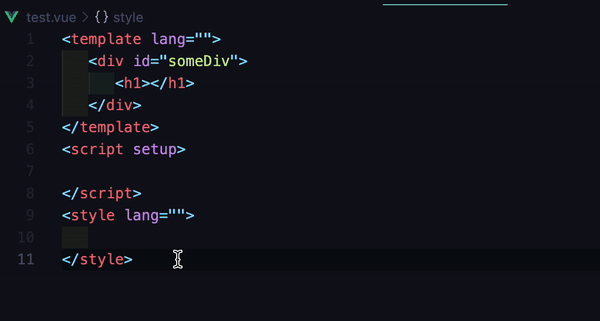

#  Test ID Generator

This extension is built to make the test-id addition process easier while coding.

## Demo Preview


## Getting Started
### Installation
- [Visual Studio Code Marketplace](https://marketplace.visualstudio.com/items?itemName=omeerdvrn.test-id-generator)

#### Via Visual Studio Code

Launch *Quick Open*:
  -  <a href="https://code.visualstudio.com/shortcuts/keyboard-shortcuts-linux.pdf">Linux</a> `Ctrl+P`
  -  <a href="https://code.visualstudio.com/shortcuts/keyboard-shortcuts-macos.pdf">macOS</a> `⌘P`
  -  <a href="https://code.visualstudio.com/shortcuts/keyboard-shortcuts-windows.pdf">Windows</a> `Ctrl+P`


Paste the following command and press `Enter`.:
```shell
ext install test-id-generator
```


### Usage

By default Shift + Alt + T (Cmd + Shift + T for Mac) key combination inserts test id to all the html elements.

It checks the element for the id first. If the element has it, it copies it to the test id. If the element has not, it generates the test id by adding elementName to the `defaultTestId` from the config.

The `attributeKeyword` is for test id attribute (`data-test`, `data-test-id`, `test-id` ...)

The `ignoreElements` is for not adding test id to all the html elements. (`<template>`, `<script>`, `<style>` ...)
#### Config

``` javascript 
// .testidrc.json
{
  "attributeKeyword": "data-test-id",
  "ignoreElements": [
    "template",
    "script",
    "style",
    "body",
    "head",
    "html",
    "header",
    "footer",
    "meta",
    "title",
    "link"
  ],
  "defaultTestId": "test"
}
```

## Contribution
Bug reports and pull requests are welcome on GitHub at https://github.com/omeerdvrn/vscode-test-id-generator. This project is intended to be a safe, welcoming space for collaboration, and contributors are expected to adhere to the Contributor Covenant code of conduct


## License
The repo is available as open source under the terms of the [MIT License](http://opensource.org/licenses/MIT).